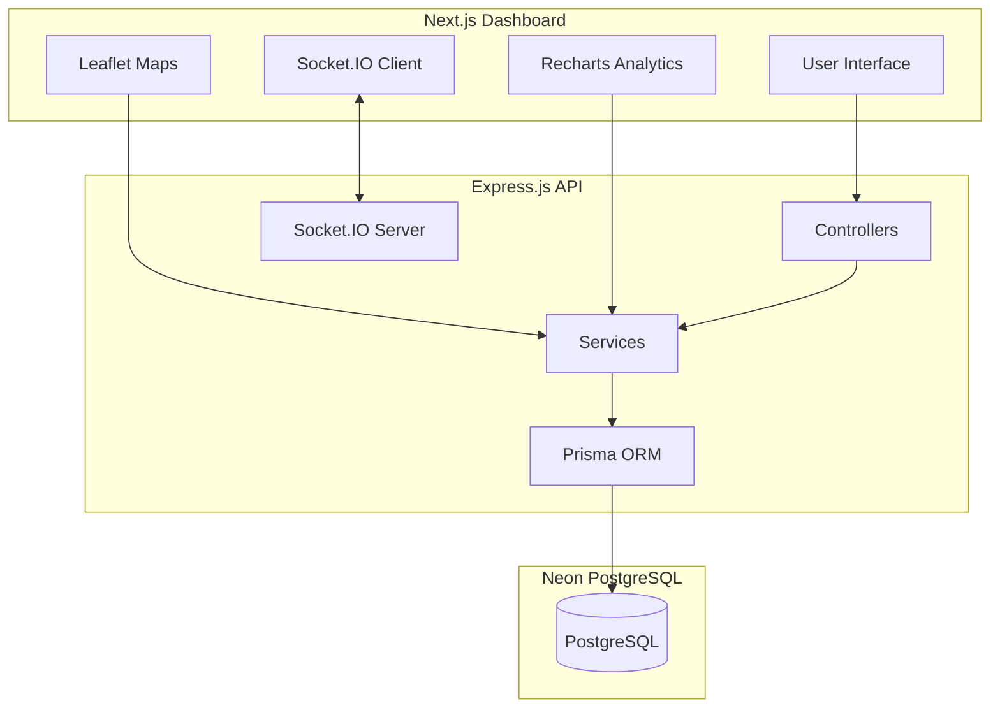
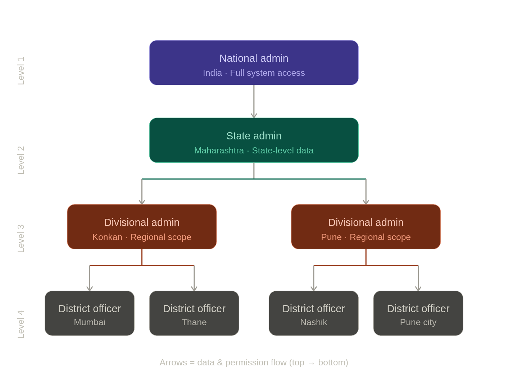
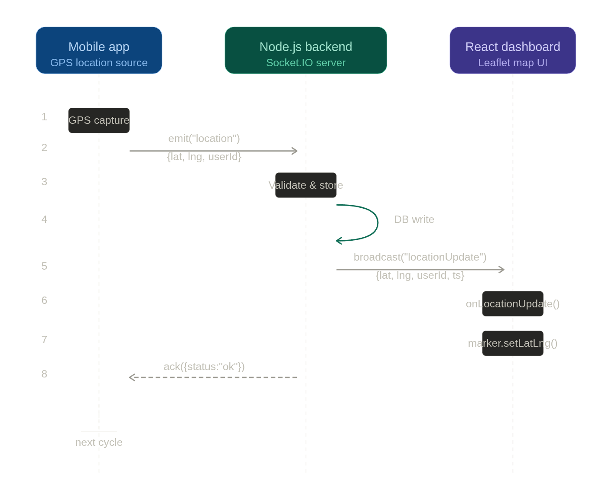
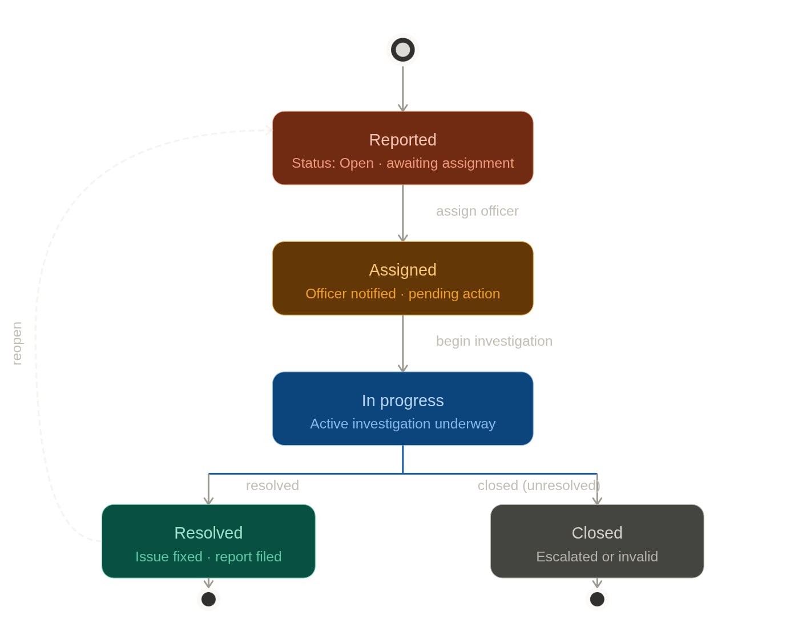

# Tourist Safety Monitoring System 🛡️

A comprehensive, real-time safety monitoring solution for tourists, featuring hierarchical administrative controls, live geospatial tracking, and advanced analytics.

## 🚀 Live Deployments

- **Dashboard**: [https://tourist-safety-monitoring-system.vercel.app/](https://tourist-safety-monitoring-system.vercel.app/)
- **Backend API**: [https://tourist-safety-monitoring-system.onrender.com](https://tourist-safety-monitoring-system.onrender.com)

---

## 🏗️ System Architecture



---

## 🌟 Key Features

### 1. Hierarchical User Management

- **Multi-Level Roles**: L1 (District), L2 (Division), L3 (State), L4 (National).
- **Geographic Filtering**: Officers only see data and subordinates within their assigned administrative region.
- **Role-Based Authorization**: High-level officers can manage lower-level staff based on strict hierarchical rules.

### 2. Live Geospatial Tracking

- **Real-Time Monitoring**: Live tracking of active tourist trips using Socket.IO.
- **District Boundaries**: Accurate GeoJSON highlighting for all 36 districts of Maharashtra.

### 3. Advanced Analytics & Incident Response

- **Incident Visualization**: Dynamic PieCharts and AreaCharts for incident types and weekly trends.
- **High Visibility**: Custom-themed charts designed for maximum readability against a premium dark theme.
- **KPI Dashboard**: Real-time stats on monitored tourists, online officers, and active incidents.

### 4. Incident Response
- **Dynamic Assignments**: Assign multiple officers to specific incidents.
- **Status Tracking**: Complete lifecycle management of safety incidents (OPEN -> IN_PROGRESS -> RESOLVED).

---

## 📂 Project Structure

- `/dashboard`: Next.js frontend application.
- `/backend`: Express.js & Prisma backend service.
- `/mobile`: Placeholder for upcoming mobile integration.
- `docker-compose.yml`: Containerized setup for local development.

---

## 🛠️ Local Development

### 1. Prerequisite
- Node.js (v18+)
- PostgreSQL (or Neon DB)
- Docker (Optional)

### 2. Backend Setup
```bash
cd backend
npm install
npm run build
npm run dev
```

### 3. Dashboard Setup
```bash
cd dashboard
npm install
npm run dev
```

---

## 📜 License
This project is licensed under the ISC License.
